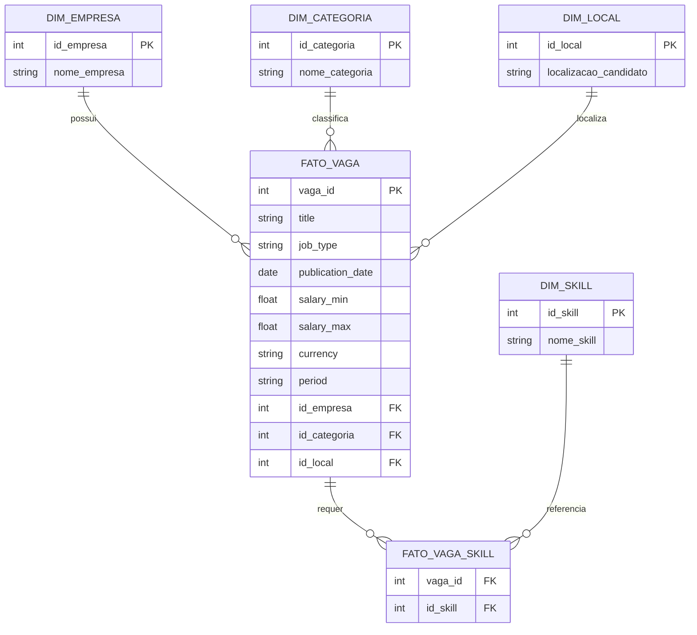

# Pipeline de Dados — Vagas Remotas (Remotive API)

## Objetivo do projeto

Implementar um pipeline de dados completo que extrai os dados de vagas remotas do Remotive API, realiza a modelagem dos dados e insere os registros em um data warehouse.

## Soluções implementadas

- Recebimento e transformação de arquivo JSON para formato tabular (DataFrame)
- Exploração dos dados para identificar nulos, valores duplicados, colunas e tipos de dados
- Tratamento e limpeza de valores despadronizados (ex: faixas salariais inconsistentes, moedas, período)
- Criação de DataFrame com a explosão da coluna de lista de habilidades por vaga
- Criação de modelo dimensional Star Schema, com a estruturação das tabelas fato e de dimensão a partir do dataset de origem
- Carga incremental no banco de dados com tratamento de conflitos (`ON CONFLICT DO NOTHING`)
- Pipeline estruturado com logging em cada etapa (extração, transformação, criação de dimensões, carga no banco)

## Modelo de dados (Star Schema)



A `fato_vaga` centraliza as métricas de cada vaga (salário, data de publicação, tipo de contrato) e se relaciona diretamente com as dimensões `empresa`, `categoria` e `local`. A relação com `skill` é muitos-para-muitos, por isso passa pela tabela ponte `fato_vaga_skill`.

## Tecnologias utilizadas

- **Python 3.14**
- **Pandas** — tratamento, limpeza e transformação dos dados
- **Regex (re)** — extração e padronização de valores despadronizados (salários, moedas, período)
- **SQLAlchemy** — conexão e execução de comandos no banco de dados
- **PostgreSQL** — armazenamento do data warehouse
- **pgAdmin 4** — administração e consulta do banco
- **Remotive API** — fonte dos dados de vagas remotas
- **logging** — rastreamento de execução do pipeline

## Estrutura do projeto

```
Projeto Remotive-API/
├── notebook/              # Notebook de exploração e prototipagem (EDA)
├── raw/                   # Dados brutos extraídos da API (JSON)
├── src/
│   ├── extract.py         # Extração dos dados da Remotive API
│   ├── transform.py       # Tratamento, limpeza e modelagem dimensional
│   ├── load.py             # Conexão e carga dos dados no banco
│   └── main.py             # Orquestração do pipeline (ETL completo)
├── .env                    # Variáveis de ambiente (credenciais do banco)
├── .gitignore
├── requirements.txt         # Dependências do projeto
└── vagas_remotas_pipeline.log  # Log de execução do pipeline
```

## Como executar

### 1. Clone o repositório

```bash
git clone https://github.com/yagosilvax/Data-Enginnering-Remotive_API.git
cd Data-Enginnering-Remotive_API
```

### 2. Crie e ative um ambiente virtual

```bash
python -m venv venv
venv\Scripts\activate      # Windows
source venv/bin/activate   # Linux/Mac
```

### 3. Instale as dependências

```bash
pip install -r requirements.txt
```

### 4. Configure as variáveis de ambiente

Crie um arquivo `.env` na raiz do projeto com as credenciais do seu banco PostgreSQL:

```
DB_HOST=localhost
DB_PORT=5432
DB_NAME=dw_remotive
DB_USER=seu_usuario
DB_PASSWORD=sua_senha
```

### 5. Crie as tabelas no banco de dados

Execute o script SQL de criação das tabelas (`create_tables.sql`) no seu banco PostgreSQL antes de rodar o pipeline.

### 6. Execute o pipeline

```bash
python src/main.py
```

O andamento da execução pode ser acompanhado em tempo real no terminal e também fica registrado no arquivo `vagas_remotas_pipeline.log`.

## Próximas etapas:

- Containerizar o projeto utilizando Docker
- Orquestrar a execução e os logs do pipeline com o Airflow

